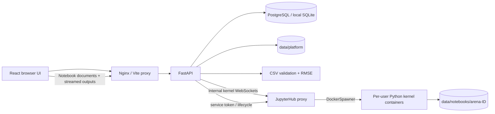

# Architecture

## First milestone

The frontend and API share an origin. The API owns accounts, sessions, dataset metadata, competition participation and submissions, notebooks, model reference cards, courses, completion records, discussions, and comments. Uploaded files have randomly generated server-side keys. User-provided filenames are only used for download labels. Public serializers exclude password hashes, storage keys, and competition solution data.

Passwords are salted and hashed using scrypt. Session tokens are random, stored as SHA-256 hashes, and expire after seven days. Mutation requests need a custom header and an allowed browser origin. Notebook updates check ownership; copying a notebook creates a separate owned record. All published content is public in this milestone. Session cleanup, revocation UI and account recovery are pending.

Scoring accepts at most 1 MB of CSV, validates headers and exact ID membership, rejects duplicates and non-finite or extreme values, and calculates RMSE server-side. The leaderboard groups submissions by participant and uses their minimum score, with username as a stable secondary ordering. There is one synthetic starter competition; its test-feature endpoint is deliberately specific to that challenge. An organizer-facing competition pipeline must store test artifacts and versioned solutions before adding arbitrary competitions.

SQLite supports simple local startup; PostgreSQL is the Compose default. PostgreSQL uses `data/postgres`; dataset files use `data/platform`, separate from database records. Hub metadata and its cookie secret use `data/hub`. The offline backup command covers the entire data tree and local credentials; see [storage operations](storage.md). Database migrations will replace `create_all` before the first schema-changing deployment. Seed initialization assumes one API process during boot.

## Reused container images

- `python:3.12-slim`: API base; follows [FastAPI's official container guidance](https://fastapi.tiangolo.com/deployment/docker/).
- `node:22-alpine`: frontend build stage; runtime is `nginx:1.28-alpine`.
- `postgres:17-alpine`: relational storage.
- `quay.io/jupyterhub/jupyterhub:5.3.0`: Hub base with DockerSpawner and an Arena session authenticator.
- `quay.io/jupyter/scipy-notebook:2025-12-31`: scientific per-user notebook base, using [Jupyter Docker Stacks](https://jupyter-docker-stacks.readthedocs.io/en/latest/using/selecting.html). Includes the scientific Python ecosystem; a thin derived image pins the Hub component to 5.3.0 and enables same-origin framing.

Image tags are explicit but not immutable. Record verified digests and scan images as part of deployment CI. No Docker socket is mounted into the web API. The Hub alone mounts the container-runtime socket. Notebook containers have separate persistent directories and memory/CPU/process budgets. Arena login is verified server-side and the gateway checks user paths, including WebSocket handshakes. This same-origin local integration is not a hostile-code sandbox; see [notebook boundaries and setup](notebooks.md).

## Planned compute boundary

The next compute milestone should introduce a job API, a separate dispatcher, and isolated execution workers. API requests create durable jobs; workers run allowlisted notebook/training images, publish logs and artifacts, and transition jobs through queued, running, succeeded, failed and cancelled states. CPU/GPU requests, limits, cancellation, timeouts, retries and per-user quotas belong in that job model.

JupyterHub with DockerSpawner now supplies per-user interactive CPU sessions, persistent directories, and start/stop controls. For public multi-tenant operation, add per-user domains, comprehensive network policies, idle cleanup and quotas; evaluate a Kubernetes spawner for cluster scheduling. Use object storage for versioned datasets and model artifacts with short-lived scoped access. Keep evaluation labels outside participant compute and separate public/private evaluation sets.

Do not add Redis, object storage or Kubernetes services to the default stack until their application integration exists. The local stack includes database, API, web gateway, and Hub containers, plus one-shot storage and image checks.
