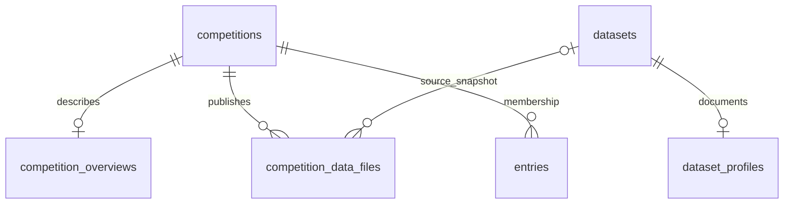

# Competition metadata and data explorer

The Overview and Data tabs now use structured database records. Organizers can edit the overview on its tab and publish/document CSV files on Data. Dataset owners can also edit source URLs, citations, documentation and column descriptions from a dataset's detail dialog.

## Database structure

| Table                    | Responsibility                                                                                                                                                                                                                         |
| ------------------------ | -------------------------------------------------------------------------------------------------------------------------------------------------------------------------------------------------------------------------------------- |
| `competitions`           | Existing title, description, prize summary, category, RMSE scorer and authoritative submission deadline. Private evaluation answers remain here and are never included in file APIs.                                                   |
| `competition_overviews`  | Start timestamp, prize details, participation instructions, evaluation notes, data documentation and update timestamp. One record per competition.                                                                                     |
| `dataset_profiles`       | Source URL, citation, documentation, row count, original-file SHA-256, column names, inferred types, missing counts and author-provided column descriptions. One profile per catalog CSV.                                              |
| `competition_data_files` | Multiple organized CSV snapshots per competition: unique relative path, role, description, license, source URL and optional source dataset ID, row count, byte size, snapshot hash, column dictionary, content and creation timestamp. |

Column dictionaries are stored as JSON arrays in text columns, supported by both PostgreSQL and SQLite. Counts and inferred types come from the stored CSV; only descriptions are editable. The current profiler distinguishes numeric and text values and counts empty, NA, NaN and null values as missing. It does not infer measurement units or semantic meaning.

Each catalog dataset currently holds one CSV; competitions can organize any number of CSV snapshots into a nested file tree. Supported roles are training, test, submission template and reference. The initial test and submission files are derived from the competition's validated test features and submission IDs. Their bytes cannot be replaced by these metadata APIs, so organizer uploads cannot silently change the scoring contract.

A snapshot remains available if its original catalog dataset is deleted: the source foreign key is cleared during deletion, while its bytes, attribution and dictionary remain. Dataset description or documentation edits do not alter already-published snapshots. Competition deletion removes its overview and file records. Dataset deletion removes its profile.

## Access and editing

- Overview, file names, purpose, descriptions, license, byte counts and row counts are public.
- File rows, column dictionaries and downloads require authentication and competition membership. The organizer has access without joining. This is enforced by the API, including the legacy `/data`, `/test` and `/sample` routes and benchmark aliases.
- Organizer controls: edit Overview; add a CSV upload or snapshot of an owned catalog dataset; document file/column meanings. Training and reference uploads support UTF-8 CSVs up to 10 MB. Files have distinct paths such as `train/features.csv`.
- The data explorer provides expandable folders, selection, a 25-row paginated table, column dictionary and authenticated download links. Membership survives refresh.
- Existing public Data Hub datasets remain public. Linking them to a competition does not make the source confidential. Public notebook code can also contain data supplied by its author.
- Overview date edits update the existing submission deadline. Dates must include a timezone and start must precede end. The start date is descriptive; joining remains available before it. Deadline enforcement continues to use the existing join/submission checks.

## API

| Operation                                 | Route                                                  |
| ----------------------------------------- | ------------------------------------------------------ |
| Read/update overview                      | `GET/PUT /api/competitions/{id}/overview`              |
| List published files / add a file         | `GET/POST /api/competitions/{id}/files`                |
| Preview 25 rows / edit file documentation | `GET/PUT /api/competitions/{id}/files/{file_id}`       |
| Page preview                              | `GET /api/competitions/{id}/files/{file_id}?offset=25` |
| Download snapshot                         | `GET /api/competitions/{id}/files/{file_id}/download`  |
| Read/update dataset documentation         | `GET/PUT /api/datasets/{id}/metadata`                  |

File creation uses multipart `path`, `role`, `description`, and either `file` (with optional `license`) or `dataset_id`. File documentation updates use JSON `description` and `column_descriptions`, a mapping of existing column names to descriptions. Dataset metadata updates use `source_url`, `citation`, `documentation`, and `column_descriptions`.

## Existing databases and persistence

Startup creates only missing tables and runs `backfill_metadata`. No existing tables are dropped or reset. Each competition's overview row marks its completed initial backfill; subsequent starts preserve its metadata, dates and snapshots. Existing uploads receive profiles when their files exist. Competitions receive test/submission snapshots, and the optional Kaggle practice pack's training datasets are associated using its stored import receipt. Legacy competitions with no creation timestamp display an unspecified start rather than an invented date.

All additions are committed in one backfill transaction. Existing users, memberships, notebooks, datasets and scores are retained. New competitions initialize metadata in their creation transaction; new dataset uploads initialize profiles before committing. The explicit sample importer also creates this metadata.

Competition snapshot bytes live in PostgreSQL alongside their metadata, under the existing `DATA_ROOT/postgres` bind mount. Original CSVs remain under `DATA_ROOT/platform/uploads`. Back up both locations together using the storage guide. This implementation targets the current 10 MB CSV workflow; large binary assets and multi-version dataset releases will need a separate object/file storage design.

## Teams and submissions

The Team tab stores teams in `competition_teams` and memberships in
`competition_team_members`. Startup creates these missing tables without resetting
existing data. A participant must join the competition first and can belong to one
team per competition. Only members can retrieve their team's invite code. Codes
are scoped to a competition. Leaving as captain transfers the role to the oldest
remaining member; leaving an empty team deletes it. Team changes close at the
competition deadline. Deleting a competition removes its teams and memberships.
Teams organize participants; they do not pool scores or automatically share notebooks.

- `GET /api/competitions/{id}/team`: own team or null (authentication required).
- `POST /api/competitions/{id}/team`: create with `{ "name": "Team name" }`.
- `POST /api/competitions/{id}/team/join`: join with `{ "invite_code": "..." }`.
- `DELETE /api/competitions/{id}/team`: leave your current team.

The Submissions tab uses the existing authenticated submissions endpoints for
prediction upload and the latest 100 results. It displays filenames, submission
times and scores, including successful notebook commits. The public Leaderboard
tab continues to display each participant's best score.
