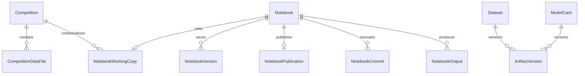

# Arena data architecture and storage review

Reviewed against the local database and file stores on 2026-09-11.

## Inventory and integrity

The initial inventory contained 167 notebooks, 31 datasets, 4 competitions, one
model card, 28 output snapshots, and 157 notebook versions. There were no hosted
model/dataset supplemental artifact versions yet. Automated integration runs also
create records, so these counts are not counts of production users or content.

The inventory found 128,599 bytes of uploaded CSVs and 477,284 bytes referenced by
notebook outputs. Identical content in separate files accounted for approximately
239 KB of duplication. Notebook working copies, publications, history, and commit
documents occupied approximately 1.61 MB combined; competition CSV snapshots added
113,428 bytes inside the database. These are application payload sizes, not total
PostgreSQL disk usage.

The initial file inventory found no missing references, size mismatches, or output
hash mismatches. The [post-deployment audit](storage-audit.json) also passed CSV hash and
saved-document source-reference checks. Run the audit below for current results. It does not read or report credentials or document
contents, and it never deletes or modifies files.

```sh
docker compose exec -T api python -m app.storage_audit
```

## Current structure



Dataset and model artifact ownership currently uses `(kind, resource_id)`, not a
foreign key; that part of the diagram describes a logical association. Notebook
inputs are versioned JSON manifests embedded in notebook documents. They are not
relational foreign keys either. Permission checks resolve each reference before
reading its bytes.

| Resource | Metadata / versions | File content |
| --- | --- | --- |
| Dataset | `datasets`, `dataset_profiles`, access and sharing tables | Primary CSV in `platform/uploads/`; supplemental versions in `platform/artifacts/` |
| Competition | `competitions`, `competition_overviews`, `competition_data_files` | Immutable public CSV snapshots still stored as database text; evaluation answers remain separate |
| Notebook | `notebooks`, working copies, versions, publication, commits | Documents in database snapshots and runtime `.ipynb` copies |
| Notebook output | `notebook_outputs` | Immutable files in `platform/notebook-outputs/` |
| Model | `model_cards`, `artifact_versions` | Hosted weights/configuration in `platform/artifacts/`; some cards may only link to an external model |
| Runtime inputs | `metadata.arena_input_sources` | Disposable copies under that notebook's `input/<source-name>-<kind>-<id>/` |

Storage keys are opaque. Human-readable filenames live in metadata and notebook
input folders. Renaming a source does not move its previously attached folder.
Runtime inputs and generated working files are separate from saved immutable
output files. Deleting or editing a runtime file does not alter its source.

## Improvements implemented

1. **Metadata-first input resolution.** Source selection and publication checks
   resolve file metadata without opening file payloads. Competition text columns
   are deferred. Runtime preparation and isolated evaluation load one input file
   at a time, rather than loading every file in the source into memory together.
   The Hub still requires a whole individual file encoded as base64; this is not
   streaming multi-gigabyte storage.
2. **Consistent manifests.** New manifests use `format_version: 2`, include a typed
   file ID, relative filename, size and SHA-256, and pin exact immutable versions.
   File types disambiguate IDs from different tables. Existing unversioned
   manifests and the old flat CSV input paths remain readable. Competition
   manifests retain their selected file IDs rather than silently adding new files.
3. **Complete dataset and model inputs.** Add Input includes hosted models.
   Dataset attachments include the primary CSV and latest supplemental artifact
   version per path; model attachments include their latest hosted artifacts.
   Reopening/forking resolves the pinned versions, not newer uploads. A newer
   supplemental version with the primary CSV's path takes precedence for a new
   attachment. Existing primary-only attachments remain primary-only.
4. **Correct output chronology with byte reuse.** Automatic saves and evaluated
   jobs use one snapshot writer. A repeated unchanged output does not add a row.
   Saving A, then B, then A creates a new latest reference to A's existing bytes.
   Old consumers stay pinned to their selected output IDs. Identical bytes are
   reused within the source notebook, without granting access across notebooks.
5. **Durable output cleanup.** Deleting a notebook queues its saved output keys
   for cleanup. A file is removed only after no output record references it.
   Historical unreferenced files are reported, not automatically erased.
6. **Query indexes.** Repeatable, additive indexes cover source/path/version
   lookups, output hashes and storage keys, owner catalogs, competition context,
   and evaluation queues. Startup applies them to existing databases with
   `checkfirst=True`; it does not rewrite existing rows.
7. **Audit command.** Reports table counts, document sizes, missing/corrupt files,
   unreferenced files, duplicate bytes, and missing saved input sources. Also
   catches orphaned polymorphic artifact ownership. It is an inventory tool, not
   a security audit or proof of every database invariant.

Example manifest file entry:

```json
{
  "id": 42,
  "kind": "artifact",
  "filename": "features/train.parquet",
  "path": "input/my-training-data-dataset-7/features/train.parquet",
  "size": 1048576,
  "sha256": "<64-character SHA-256>"
}
```

The local input source limit is 1,000 files / 200 MB. Individual upload, output,
and execution limits still apply. Preview supports CSV/TSV and plain text; model
binaries and Parquet can be consumed by Python but are not rendered as tables.

## Next structural migration

The immediate storage volume is small. A destructive rewrite or external object
store is not necessary for this local test. Before growing to large competitions,
use a migration with explicit versions and a backup/restore rehearsal:

- Introduce immutable `file_objects` keyed by hash and size, with a backend key
  that works for local storage now and S3-compatible storage later. Keep
  authorization on resource/version references, never on knowledge of a hash.
- Add `resource_versions` and typed `resource_files` references for datasets,
  models, competition bundles, notebook versions and outputs. Move competition
  CSV bodies and large notebook documents out of table rows after checksum-
  verified copy and backfill; keep old fields readable until verification passes.
- Normalize notebook input provenance into version-to-version edges while
  retaining portable manifests in exported `.ipynb` files. Define source deletion
  explicitly: block deletion while referenced, retain tombstones, or retain
  snapshots. Currently deleting a source can make dependent notebooks fail to
  reopen or execute; the audit detects missing source references.
- Store per-run output manifests, environment/image digest, logs, prediction bytes
  and evaluation configuration. Current output references are immutable files,
  but not a complete version-to-run lineage model. Manual submission rows retain
  score/filename metadata; raw submission retention needs a dedicated artifact.
- Separate version labels from document payloads. History listing currently reads
  document JSON to extract labels, and label edits mutate version metadata even
  though cell snapshots are retained.
- Replace polymorphic associations with typed foreign keys and introduce an
  explicit migration ledger, timestamp types, status constraints, and retention
  policies. Existing string timestamps and startup `create_all` are compatible
  scaffolding, not a comprehensive schema migration system.
- Add model registry policy (private versions, stage, environment, provenance,
  large resumable uploads). Current hosted model cards/artifacts are public under
  the existing model policy. Large uploads should use object-storage streaming,
  rather than merely increasing the local upload cap.

No historical user files, competitions, notebooks, or model cards were deleted or
bulk-rewritten during this review. Existing paths and source IDs remain valid.
